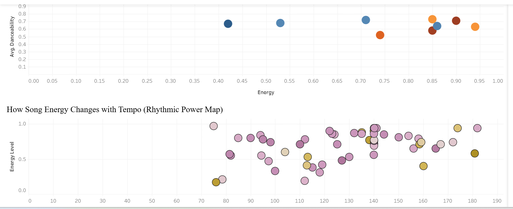
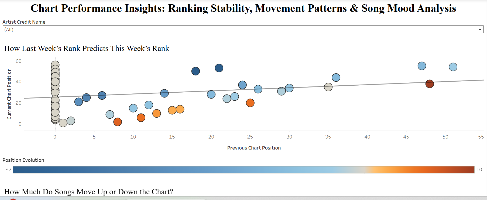

# 📊 Chart Performance Insights

## **Ranking Stability, Movement Patterns & Song Mood Analysis**

---

## **🎯 Project Overview**

This interactive Tableau dashboard analyzes weekly music chart performance to uncover structured patterns in ranking behavior and audio characteristics.

The project focuses on understanding:

- **Ranking Stability**
- **Weekly Position Movement**
- **Energy & Danceability Relationships**
- **Tempo Influence on Song Performance**
- **Mood Patterns Using Valence**

This dashboard transforms raw chart data into strategic performance insights using visual analytics.

---

## **📌 Dashboard Structure**

---

## **1️⃣ Ranking Stability Analysis**

## **How Last Week’s Rank Predicts This Week’s Rank**

**Visualization Type:** Scatter Plot with Trend Line  
**X-Axis:** Previous Chart Position  
**Y-Axis:** Current Chart Position  
**Color Encoding:** Position Evolution (Movement)  
**Filter:** Artist Credit Name (Interactive)

### **Key Insights**

- There is a strong positive relationship between last week's rank and this week's rank.
- Songs that start high tend to remain high.
- Lower-ranked songs show higher volatility.
- New entries (rank 0 previously) show wide performance dispersion.

**Interpretation:** Chart momentum plays a significant role in ranking persistence.

---

## **2️⃣ Chart Movement Distribution**

## **How Much Do Songs Move Up or Down the Chart?**

**Visualization Type:** Histogram (Position Evolution Bin)  
**Metric:** Weekly rank change

### **Key Insights**

- Most songs move within a small range (±5 positions).
- Large upward or downward jumps are uncommon.
- The majority of weekly ranking changes are incremental.

**Interpretation:** Chart performance changes gradually rather than dramatically.

---

## **3️⃣ Song Mood Map**

## **Energy vs Danceability (Colored by Valence)**

**Visualization Type:** Bubble Scatter Plot  
**X-Axis:** Energy  
**Y-Axis:** Danceability  
**Color:** Valence (Emotional Positivity)

### **Key Insights**

- High-energy songs often show higher danceability.
- Positive-valence songs cluster in strong performance zones.
- Mood features correlate with chart presence patterns.

**Interpretation:** Songs that are energetic, danceable, and emotionally positive show stronger chart consistency.

---

## **4️⃣ Rhythmic Power Analysis**

## **Energy vs Tempo (BPM)**

**Visualization Type:** Scatter Plot  
**X-Axis:** Tempo (BPM)  
**Y-Axis:** Energy Level

### **Key Insights**

- Most high-energy songs fall between 110–150 BPM.
- Extremely slow or extremely fast tempos are less frequent in strong chart performers.
- Tempo influences energy but does not fully determine it.

**Interpretation:** There appears to be a tempo range associated with optimal chart performance.

---

## **📊 Analytical Themes Explored**

- **Ranking Persistence**
- **Volatility & Momentum**
- **Distribution of Weekly Movement**
- **Mood-Based Audio Analysis**
- **Tempo-Energy Relationships**
- **Interactive Artist Filtering**

---

## **🛠 Tools & Technologies**

- **Tableau Public**
- Data Visualization
- Trend Line Analysis
- Distribution Analysis
- Audio Feature Correlation

---

## **📂 Files Included**

- Tableau Packaged Workbook (.twbx)
- Supporting Dataset (Sample - Superstore.xls)
- Dashboard Screenshot Preview

---

## **🚀 How to View**

1. Download the `.twbx` file.
2. Open using Tableau Public or Tableau Desktop.
3. Use the **Artist Credit Name** filter to explore artist-level behavior.
4. Interact with visuals to analyze ranking and mood dynamics.

---

## **💡 Business Relevance**

This project demonstrates how performance data combined with audio features can be used to:

- Identify ranking stability patterns
- Analyze volatility behavior
- Understand performance-driving attributes
- Support data-driven music strategy

---

## **👤 Author**

**Nicky Kumari**  
Data Analytics | Visualization | Business Intelligence
